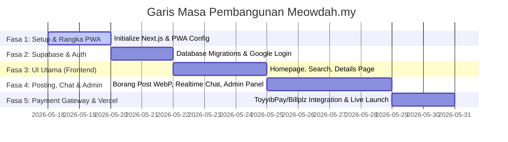

# 📅 Pelan Fasa Pembangunan: Meowdah.my (Fasa 1 - Fasa 5)

Dokumen ini menjelaskan pembahagian tugas yang jelas antara **Antigravity (AI)** yang akan menulis 100% kod aplikasi, dan **Anda (User)** yang akan menguruskan pendaftaran akaun dan penyediaan kunci kelayakan (*credentials*) bagi perkhidmatan pihak ketiga.

---

## 🗺️ Gambaran Keseluruhan Fasa Pembangunan

---

## 🛠️ Pembahagian Tugasan Mengikut Fasa

### 🟢 FASA 1: Setup Projek & Rangka PWA
> **Fokus:** Menubuhkan struktur projek Next.js gred enterprise, reka bentuk sistem Vanilla CSS (Oyen Orange) dan integrasi PWA penuh.

* **🤖 Tugas AI (Coding):**
  1. *Initialize* projek Next.js (TypeScript, Vanilla CSS Modules, App Router).
  2. Setup fail tetapan PWA (`manifest.json`, registering service worker, setup icon web).
  3. Membina sistem reka bentuk Vanilla CSS (`globals.css` mengandungi CSS variables warna oren oyen, butang premium, Outfit/Inter typography).
  4. Setup **Graphifyy** (`pip install graphifyy`), jalankan analisis awal codebase, dan configure fail `package.json` dengan script `"graph": "graphifyy ."` untuk kemas kini visualisasi secara manual.
* **👤 Tugas Anda (Account Setup):**
  1. Mulakan inisialisasi Git tempatan (`git init`) di folder `Marketplace Kucing` dan sambungkan ke akaun GitHub anda.

---

### 🟢 FASA 2: Pangkalan Data (Supabase) & Pintu Masuk Auth (Google Login)
> **Fokus:** Setup database PostgreSQL Supabase berserta polisi keselamatan Row-Level Security (RLS) dan log masuk satu klik akaun Google.

* **🤖 Tugas AI (Coding):**
  1. Mengarang skrip SQL Migrasi lengkap untuk 6 jadual asas (`profiles`, `ads`, `chats`, `messages`, `reports`, `system_settings`) lengkap dengan **polisi RLS PostgreSQL**.
  2. Membina fail utiliti Supabase Client & Server di Next.js (`@supabase/ssr`).
  3. Membina Halaman Login (Screen 7) berserta fungsi integrasi Google OAuth redirect & callback API Route.
* **👤 Tugas Anda (Account Setup):**
  1. Cipta projek baru di [Supabase Console (Percuma)](https://supabase.com).
  2. Salin skrip SQL yang disediakan oleh AI, tampal di dalam *Supabase SQL Editor*, dan tekan **Run** untuk bina jadual database & RLS.
  3. Setup projek Google OAuth di [Google Cloud Console (Percuma)](https://console.cloud.google.com) untuk dapatkan `Google Client ID` & `Client Secret`.
  4. Masukkan kelayakan Google tadi di tab **Auth Providers -> Google** di Supabase Dashboard.
  5. Sediakan kunci sulit Supabase (`NEXT_PUBLIC_SUPABASE_URL` & `NEXT_PUBLIC_SUPABASE_ANON_KEY`) di dalam fail `.env.local` projek.

---

### 🟢 FASA 3: Pembangunan UI Core Frontend (Homepage, Search & Details)
> **Fokus:** Melahirkan antaramuka utama yang premium, responsif, dan laju berasaskan reka bentuk "Oyen Orange".

* **🤖 Tugas AI (Coding):**
  1. Membina **Screen 1 (Homepage)**: Reka search bar gergasi, slider kategori kucing/keperluan, lokasi pantas, & grid iklan premium.
  2. Membina **Screen 2 (Search Results & Filter)**: Panel tapis baka, umur, harga, vaksin, serta bottom-sheet tapisan khas mobile. Integrasikan carian jarak Geolocation.
  3. Membina **Screen 3 (Ad Details Page)**: Galeri gambar kucing (carousel), lencana kesihatan (vaccinated/neutered), panel kedai penjual, koordinat lokasi peta (OpenStreetMap), serta butang CTA Chat/WhatsApp.
  4. Membina **Screen 8 (Public Seller Profile)**: Halaman paparan profil "Pro Niaga".
* **👤 Tugas Anda (Account Setup):**
  - Tiada. Tugas anda hanya menyemak (*review*) hasil reka bentuk UI yang dibina oleh AI menggunakan pelayar.

---

### 🟢 FASA 4: Borang WebP Posting, Realtime Chat & Dashboard Admin
> **Fokus:** Mengaktifkan fungsi interaktif platform (muat naik gambar WebP, watermark, live-chat realtime, dan kawalan moderasi admin).

* **🤖 Tugas AI (Coding):**
  1. Membina **Screen 4 (Borang Post Ad)**: Borang multi-langkah. Integrasikan fungsi *client-side converter* yang auto-tukar format gambar ke WebP, buang koordinat EXIF peranti, dan menampal watermark tulisan `Meowdah.my` menggunakan HTML5 Canvas sebelum upload ke Supabase Storage.
  2. Membina **Screen 5 (Seller Dashboard)**: Urus iklan aktif, edit, delete, atau tukar status ke "SOLD".
  3. Membina **Screen 6 (Live Inbox Chat Room)**: Bilik sembang realtime menggunakan integrasi PostgreSQL Listen/Notify (Supabase Realtime).
  4. Membina **Screen 9 (Admin Dashboard)**: Halaman moderasi bagi menyekat scammer, meluluskan badge *Verified Breeder*, dan **Panel Tetapan Payment Gateway** dinamik.
* **👤 Tugas Anda (Account Setup):**
  1. Cipta *Storage Bucket* bernama `ads` di Supabase Storage, setkan status bucket sebagai "Public", dan benarkan polisi muat naik untuk akaun berdaftar.

---

### 🟢 FASA 5: Integrasi Pintu Gerbang Pembayaran & Pelancaran Live (Vercel)
> **Fokus:** Menyambungkan sistem pembayaran ToyyibPay / Billplz yang dinamik, menguji transaksi sandbox, dan melancarkan platform secara live di Vercel.

* **🤖 Tugas AI (Coding):**
  1. Menulis kod API Route Next.js untuk mencipta transaksi dinamik ToyyibPay & Billplz mengikut kunci API yang dibaca dari database.
  2. Menulis kod API Webhook Endpoint selamat untuk menerima callback status pembayaran yang sah dari gateway.
* **👤 Tugas Anda (Account Setup):**
  1. Daftar akaun ToyyibPay Sandbox (atau Billplz Sandbox) untuk tujuan ujian.
  2. Masukkan kunci API ToyyibPay/Billplz sandbox anda terus melalui **Screen 9 (Halaman Admin)** yang telah kita bina.
  3. Uji bayaran percuma (*Sandbox test payment*) untuk menaikkan iklan premium.
  4. Sambungkan akaun GitHub anda ke [Vercel Console (Percuma)](https://vercel.com) dan lancarkan projek **Meowdah.my** secara rasmi ke internet!

---

## ❓ Persetujuan Fasa Pembangunan

> [!IMPORTANT]
> **Adakah pembahagian tugasan ini adil dan bertepatan dengan perancangan anda?**

Jika anda bersetuju, sila balas dengan **"Approve"** atau tulis ulasan anda. Setelah diluluskan, saya akan terus memulakan **FASA 1** dengan menginisialisasi fail projek Next.js PWA di folder `Marketplace Kucing` anda!
