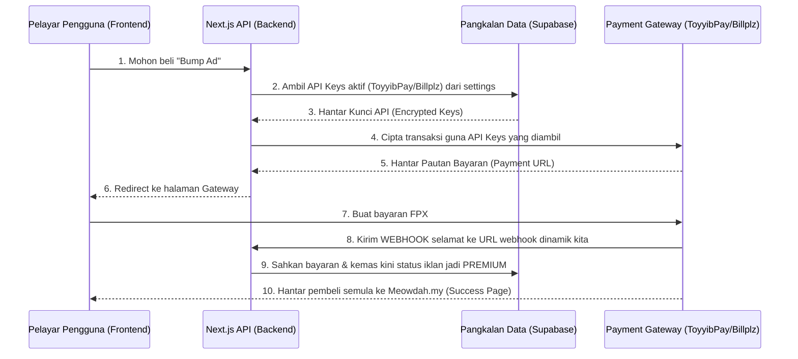
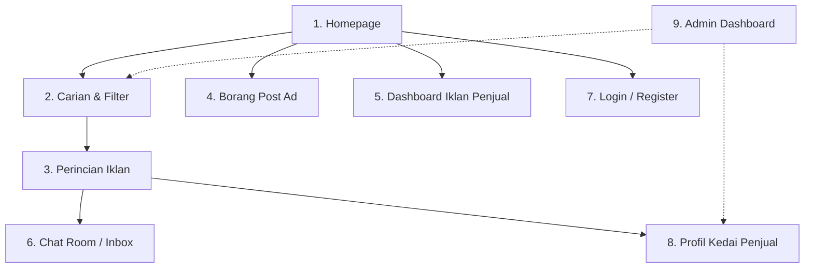

# 🐱 Implementation Plan: Meowdah.my (Marketplace Kucing Terbaik Malaysia)

Mari kita bina sebuah platform classifieds/marketplace yang khas untuk peminat kucing di Malaysia. Kita nak bawakan "feel" macam Mudah.my (mudah digunakan, fokus pada lokasi, dan carian pantas) tapi dengan rekaan yang jauh lebih moden, premium, dan spesifik untuk kucing.

---

## 🏷️ Nama Platform Rasmi: Meowdah.my
Platform ini rasmi dinamakan **Meowdah.my** (gabungan *Meow* + *Mudah*). Nama ini sangat mudah diingati, mesra SEO, dan terus menggambarkan apa yang ditawarkan oleh aplikasi.

---

## 💳 Sistem Payment Gateway Malaysia (ToyyibPay & Billplz Admin Dynamic Setup) [UPDATED]

Bagi memudahkan urusan pentadbiran (*administration*), platform ini akan dibina dengan **sistem pintu gerbang pembayaran dinamik**. Anda selaku pemilik platform tidak perlu mengubah kod (*codebase*) atau memuat semula (*redeploy*) Vercel sekiranya mahu menukar akaun ToyyibPay atau Billplz. 

Semua tetapan kunci keselamatan (*API Keys*) boleh dimasukkan secara langsung melalui **Halaman Admin** dan disimpan secara selamat dalam database:

### 1. Saluran Pembayaran yang Disokong
* **ToyyibPay (FPX Online Banking):** Caj rata RM1.00 bagi setiap transaksi.
* **Billplz (FPX Online Banking):** Caj rata sekitar RM1.50 bagi setiap transaksi.

### 2. Panel Tetapan Dinamik di Halaman Admin
Di dalam **Admin Dashboard (Screen 9)**, kita akan bina satu ruangan khas bertajuk **"Payment Settings"** yang mengandungi borang input selamat:
* **Untuk ToyyibPay:**
  - `ToyyibPay Secret Key` (Input terlindung)
  - `ToyyibPay Category Code`
* **Untuk Billplz:**
  - `Billplz API Key` (Input terlindung)
  - `Billplz Collection ID`
  - `Billplz X-Signature Key` (Untuk keselamatan verifikasi webhook)
* **Butang Pilihan Aktif (Active Gateway Toggle):** Membolehkan admin memilih sama ada mahu mengaktifkan **ToyyibPay** atau **Billplz** (atau mematikan terus fungsi pembayaran).

### ⚡ Aliran Kerja Transaksi Dinamik (Dynamic Secure Payment Flow)
Apabila user membuat pembelian, server backend Next.js akan membaca kunci API aktif terus dari database:

---

## 💰 Model Perniagaan & Strategi Revenue (Business Model)

Bagi memastikan **Meowdah.my** bukan sekadar projek hobi, tetapi perniagaan yang mapan (*sustainable*) dan mampu menjana keuntungan bersih yang tinggi, berikut adalah **5 model menjana pendapatan (revenue streams)** yang boleh dilaksanakan:

### 1. Visibility Boosters (Booster Iklan ala Mudah.my)
Penjual membayar yuran kecil (mikro-transaksi) untuk menaikkan keterlihatan iklan mereka di platform:
* **Bump Ad (RM3 - RM5 sekali guna):** Menolak iklan penjual ke tempat paling atas dalam carian secara sertamerta (seolah-olah iklan baru).
* **Featured Ad (RM10 - RM15 seminggu):** Meletakkan iklan penjual di ruangan slaid premium teratas halaman utama (*Homepage*) and halaman carian dengan sempadan oren menyerlah.
* **Urgent Ad (RM5 sekali guna):** Menampal lencana merah berkilat **"URGENT"** pada iklan.

### 2. Langganan "Pro Niaga" (Monthly Subscriptions)
Hadkan penggunaan bagi akaun percuma bagi menggalakkan penjual tegar melanggan:
* **Akaun Percuma:** Maksimum 3 iklan aktif pada satu-satu masa. Tiada statistik.
* **Pelan Pro Niaga (RM29 - RM89/bulan):** Khas untuk *Pet Shop*, *Cattery* (Breeder berdaftar), *Groomer*, dan pembekal makanan kucing.
  - Slot iklan tanpa had atau lebih tinggi (cth: 30 - 100 iklan aktif).
  - Profil kedai tersuai (Custom Storefront) di mana mereka mendapat pautan sendiri (`meowdah.my/store/oyen-petshop`) lengkap dengan logo dan banner kedai.
  - Lencana **"Verified Seller"** automatik.
  - Papan pemuka (*dashboard*) analitik untuk melihat jumlah paparan iklan dan klik butang WhatsApp/Chat.

### 3. Iklan Ditaja Niche Kucing (Direct Sponsored Ads & AdSense)
Kerana trafik kita 100% adalah pencinta kucing tegar di Malaysia, platform ini merupakan **"goldmine"** (lubuk emas) buat jenama-jenama produk haiwan:
* **Sponsorship Terus:** Menjual ruang banner iklan di platform secara terus kepada jenama makanan kucing (seperti *Royal Canin*, *Whiskas*, *Brit*), pasir kucing, hotel kucing, atau klinik veterinar tempatan.
* **Programmatic Ads:** Memasang Google AdSense di ruang-ruang kosong bagi menjana pendapatan automatik berdasarkan jumlah trafik bulanan.

### 4. Komisen Transaksi Selamat (Escrow Services / Safe Checkout)
* **Senario:** Untuk mengurangkan kes scammer COD kucing/barang secara mutlak, kita perkenalkan sistem **"MeowPay"** (Escrow).
* **Aliran:** Pembeli membayar harga barang/kucing melalui platform kita (menggunakan Stripe/FPX). Kita memegang wang tersebut secara selamat. Sebaik sahaja COD disahkan selesai secara fizikal oleh kedua-dua pihak, wang dilepaskan kepada penjual.
* **Revenue:** Kita mengenakan caj komisen sebanyak **2% hingga 5%** daripada nilai transaksi sebagai yuran perkhidmatan.

### 5. Yuran Pengauditan Badge "Verified Breeder"
* Breeder kucing baka tulen yang mahukan lencana khas **"Verified Breeder"** (untuk membina kepercayaan pembeli baka mahal seperti BSH/Munchkin) perlu menyerahkan sijil kelayakan/pendaftaran cattery mereka.
* Kita mengenakan yuran pengauditan satu kali (*one-time auditing fee*) sebanyak **RM50** untuk proses verifikasi dokumen rasmi secara manual oleh admin platform.

---

## 🎨 Pelan Penjenamaan & Identiti Visual (Branding System)

Untuk memastikan **Meowdah.my** mempunyai identiti yang sangat premium, diingati, dan dipercayai oleh komuniti cat lovers di Malaysia, berikut adalah sistem penjenamaan rasmi kita:

### 1. Konsep Logo
* **Idea Reka Bentuk:** Logo gabungan (combination mark) di mana perkataan **Meowdah** menggunakan font bulat moden, dan huruf **"o"** digantikan dengan ilustrasi minimalis kepala kucing oyen comel yang mempunyai telinga tajam.
* **Logo Tanda (Icon/Favicon):** Kepala kucing oyen yang digabungkan dengan ikon "Pin Lokasi" (Classifieds) untuk melambangkan carian hyper-local.

### 2. Sistem Warna Rasmi (Warm Amber & Cream Palette)
Kita menggunakan kod warna spesifik untuk memberikan impak visual yang sangat premium dan harmoni:
* 🟧 **Primary (Oyen Orange):** `#FF8C32` — Warna utama untuk butang tindakan (CTA), tajuk penting, dan elemen aktif. Melambangkan tenaga kucing oyen, mesra, dan merangsang tindakan membeli.
* 🟫 **Secondary (Ginger Amber):** `#E07A2F` — Untuk kesan hover pada butang dan sub-kategori.
* 🟩 **Accent (Mint Green):** `#2ECC71` — Warna khas untuk menunjukkan status kesihatan kucing (*Vaccinated*, *Neutered*) dan *Verified Breeder*. Melambangkan keselamatan dan kesihatan.
* ⬛ **Neutral Dark (Charcoal Black):** `#2D2D2D` — Untuk teks utama. Lebih lembut pada mata berbanding hitam pekat (`#000000`).
* 🥛 **Neutral Light (Warm Cream):** `#FFF8F3` — Warna latar belakang utama platform. Memberikan rasa selesa, organik, dan hangat berbanding putih kosong biasa.

### 3. Tipografi (Typography)
* **Font Tajuk (Headings):** **Outfit** (Google Fonts) — Reka bentuk font sans-serif geometri dengan bucu bulat yang memberikan estetika moden, mesra haiwan, dan sangat premium.
* **Font Teks (Body Text):** **Inter** (Google Fonts) — Standard industri untuk kejelasan pembacaan yang sangat tinggi pada skrin telefon pintar sekecil mana pun.

### 4. Tagline Pemasaran (Taglines)
* *"Meowdah.my: Mudah Cari Jodoh & Keperluan Si Bulus!"* (Fokus kepada kepelbagaian kategori servis & barang).
* *"Dari Pencinta Kucing, Untuk Pencinta Kucing."* (Mewujudkan rasa kebersamaan komuniti).

### 5. Nada Suara (Voice & Tone)
* **Santai & Mesra (Friendly & Playful):** Menggunakan bahasa mesra cat lovers seperti *"Si Bulus"*, *"Oyen"*, dan *"Adopsi"* untuk membina hubungan emosi.
* **Kredibel & Selamat (Secure):** Memberikan amaran keselamatan anti-scam secara jelas, profesional, dan telus tanpa menakut-nakutkan pengguna.

---

## 📱 Ciri Utama: Progressive Web App (PWA)
Berdasarkan permintaan anda, platform ini akan dibangunkan sebagai **PWA**. Ini bermaksud:
- **Mudah Dipasang (Installable):** Pengguna boleh install website ini terus ke skrin utama telefon bimbit mereka (iOS & Android) seperti app biasa tanpa perlu melalui App Store/Play Store.
- **Splash Screen & App Icon:** Memberikan identiti aplikasi native sebaik sahaja dibuka.
- **Offline Capabilities:** Sistem cache untuk membolehkan sesetengah halaman diakses secara offline.
- **PWA Tools (Next.js):** Kita akan gunakan `@ducanh2912/next-pwa` or `@serwist/next` yang terbukti stabil untuk Next.js App Router.

---

## 📊 Integrasi Visualisasi Seni Bina: Graphifyy [NEW]
Bagi membolehkan pemantauan visual seni bina (*architecture*) projek, kita menyepadukan **Graphifyy** ke dalam workflow pembangunan:
* **Fungsi Graphifyy:** Menganalisis sambungan import, dependency fail, dan visualisasi modul Next.js ke dalam format graf interaktif.
* **Hasil Visualisasi (`graphify-out/`):**
  - `graph.html`: Graf interaktif berasaskan web yang menunjukkan kelompok (*clusters*) kod.
  - `GRAPH_REPORT.md`: Laporan audit yang mengesan fail yang terlalu besar (*god nodes*) atau silang-import silang.
* **Arahan Setup:** Pembina (AI/User) akan menjalankan `pip install graphifyy` dan menjana graf `graphifyy .` pada setiap akhir fasa pembangunan utama.

---

## 💰 Kos Pembagunan MVP: 100% PERCUMA (Free Tier & Live Dev)
Untuk fasa MVP ini, kita akan gunakan pilihan teknologi gred enterprise yang menawarkan **Free Tier** yang sangat luas. Anda tidak perlu bayar apa-apa untuk hoskan secara *live*:

1. **Next.js + Vercel (Hosting & Deployment):**
   - **Kos:** RM0 / Selamanya (Vercel Hobby Tier).
   - Menyokong *Live Development* secara automatik. Setiap kali kita buat perubahan kod (push ke GitHub), Vercel akan bina *live preview link* secara automatik.
2. **Supabase (Database, Auth & Storage):**
   - **Kos:** RM0 / Selamanya (Supabase Free Tier).
   - Menyediakan:
     - 500MB Database PostgreSQL (Cukup untuk puluhan ribu iklan kucing).
     - 1GB Storage (Cukup untuk ribuan gambar kucing di-optimize).
     - 50,000 Monthly Active Users (MAU) untuk Auth secara percuma.
     - Realtime database untuk live-chat percuma.
3. **Peta / Lokasi:**
   - Gunakan OpenStreetMap API (Percuma) menggantikan Google Maps API (yang berbayar) untuk peta interaktif dan pilihan koordinat lokasi.

---

## 🎨 UI/UX: Senarai 9 Halaman Utama (Screens Map)

Untuk memberikan pengalaman seiras Mudah.my tetapi lebih premium, berikut adalah senarai **9 antaramuka (UI) wajib** yang akan kita bina (termasuk Halaman Admin):

### 1. Homepage (Laman Utama)
- **Komponen:** Search bar gergasi, grid kategori (Kucing, Makanan, Aksesori, Servis), pemilih lokasi pantas, senarai iklan premium/terkini (carousel), dan butang "Post Ad" terapung (floating button) di mobile.

### 2. Search & Search Results (Halaman Carian)
- **Komponen:** Grid senarai iklan, bar penapis (filter) mengikut Harga, Lokasi, Kategori, Baka, Status Kesihatan (Vaksin/Kasi).
- Reka bentuk mesra mobile dengan "Filter Bottom Sheet" yang boleh ditarik dari bawah.

### 3. Listing Details Page (Halaman Perincian Kucing/Barang)
- **Komponen:** Galeri gambar (carousel), paparan harga & baka, lencana kesihatan (Health Badges), deskripsi iklan, seksyen peta lokasi (COD point), maklumat penjual, butang pintas "Chat" dan "WhatsApp" (opsional).

### 4. Borang Post Ad (Halaman Buat Iklan)
- **Komponen:** Borang langkah-demi-langkah (Step-by-step form) mesra pengguna.
  1. Pilih Kategori & Baka/Jenis.
  2. Isi Detail (Tajuk, Harga, Deskripsi, Lencana Kesihatan).
  3. Upload Gambar (Multi-image uploader dengan preview).
  4. Pilih Lokasi (State & City).

### 5. Seller Dashboard / Ad Manager (Pengurusan Iklan)
- **Komponen:** Tab untuk "Iklan Aktif", "Iklan Tamat Tempoh", dan "Draf". Butang untuk edit iklan, padam, atau tandakan sebagai "SOLD" ala Mudah.my.

### 6. Live Chat Room / Inbox (Peti Mesej)
- **Komponen:** Rekaan dwi-panel (Desktop) or satu panel (Mobile). Senarai chat dengan pembeli/penjual lain secara masa-nyata (realtime chat) lengkap dengan gambar mini produk yang sedang dirunding.

### 7. Auth Page (Daftar / Log Masuk)
- **Komponen:** Fokus utama menggunakan **Google Login (Supabase OAuth)** untuk satu klik pendaftaran/log masuk yang sangat pantas. Tiada keperluan ingat password.

### 8. Public Seller Profile (Profil Kedai Penjual)
- **Komponen:** Macam halaman "Pro Niaga" Mudah.my. Memaparkan nama penjual, gambar profil, tarikh menyertai, rating/review (jika ada), dan senarai semua iklan yang sedang dijual oleh penjual tersebut.

### 9. Admin Dashboard (Halaman Admin & Moderasi)
- **Komponen:** 
  - **Status Ringkas:** Jumlah iklan aktif, laporan baru, & permohonan *Verified Breeder*.
  - **Moderasi Laporan (Reports Panel):** Senarai iklan yang dilaporkan oleh pengguna. Admin boleh semak sebab laporan dan klik butang "Tolak Laporan" (Keep Ad) atau "Padam Iklan" (Delete/Suspend Ad).
  - **Pengurusan Ahli & Breeder:** Meluluskan permohonan badge *Verified Breeder* atau menyekat (*ban*) akaun scammer tegar.
  - **Konfigurasi Pembayaran (Payment Settings Panel):** Borang input dinamik (terkunci dengan RLS) untuk memasukkan `ToyyibPay API/Secret Key & Category Code` atau `Billplz API Key & Collection ID` secara terus ke dalam pangkalan data.

---

## 🚀 Cadangan Penambahbaikan Kreatif (Unique Value Add)

Untuk menaikkan lagi taraf platform ini berbanding Mudah.my sedia ada, ini adalah **4 idea penambahbaikan** yang sangat berkesan dan praktikal untuk dibina:

### 1. Sistem Auto-Watermark Gambar (Anti-Scammer)
- **Cadangan:** Apabila penjual memuat naik gambar di Borang Post Ad, sistem kita akan secara automatik menampal logo platform (`Meowdah.my`) dan *username* penjual sebagai watermark separa telus (semi-transparent watermark) di atas gambar tersebut sebelum disimpan ke database. Scammer tidak boleh curi gambar tersebut!

### 2. Integrasi Pintas "WhatsApp Chat" (Fallback System)
- **Cadangan:** Selain daripada *in-app live chat*, kita sediakan butang "Hubungi via WhatsApp". Bila diklik, ia akan membuka WhatsApp dengan teks template siap sedia:
  > *"Salam, saya berminat dengan iklan kucing [Nama Kucing] berharga [Harga] di Meowdah.my. Boleh COD? [Link Iklan]*"

### 3. Subkategori "Cari Jodoh Kucing" (Stud Service / Mating)
- **Cadangan:** Di Malaysia, ramai pencinta kucing mencari pasangan untuk baka kucing mereka (contohnya mencari pasangan BSH / Parsi). Kita wujudkan subkategori khusus **"Mating/Stud Service"** di bawah Kategori Servis.

### 4. Carian Radius "Kucing Terdekat" (Geolocation "Near Me")
- **Cadangan:** Di halaman carian, selain filter mengikut Negeri/Bandar, pengguna boleh benarkan lokasi GPS mereka untuk mencari makanan kucing, pasir kucing, atau kedai kucing yang berada dalam radius **5km, 10km, atau 20km** dari tempat mereka.

---

## 🛡️ Pelan Keselamatan Aplikasi (Security Architecture Plan)

Bagi menjamin keselamatan data pengguna, mengelakkan scam, dan melindungi platform daripada serangan penggodam, kita akan mengikut standard keselamatan industri berikut:

### 1. Authentication & Session Security (Google OAuth)
- **Supabase Auth:** Sesi pengguna diuruskan menggunakan JWT (JSON Web Tokens) yang disimpan dalam kuki selamat (`HttpOnly`, `Secure`, `SameSite=Lax`). Ini menghalang serangan curi sesi (*Session Hijacking*).
- **Tiada Password Tempatan:** Memandangkan kita menggunakan Google OAuth, platform kita **tidak menyimpan** sebarang kata laluan pengguna. Ini menghapuskan risiko kecurian pangkalan data (*Credential Leak*).

### 2. Database Security (Supabase Row-Level Security - RLS)
Setiap jadual (table) dalam PostgreSQL akan dipagari oleh polisi RLS yang sangat ketat:
* **Jadual `profiles` (Profil):**
  - *Read:* Boleh dibaca oleh sesiapa sahaja (awam).
  - *Write:* Hanya pengguna pemilik profil tersebut sahaja yang boleh kemas kini data mereka sendiri.
* **Jadual `ads` (Iklan):**
  - *Read:* Hanya iklan aktif sahaja boleh dibaca oleh awam.
  - *Write:* Hanya pemilik iklan (authenticated) yang boleh mencipta, mengemas kini, atau memadam iklan mereka.
  - *Premium Columns (`is_featured`)*: Dikunci terus daripada kemas kini pengguna biasa. Hanya server backend sahaja yang boleh ubah.
* **Jadual `chats` & `messages` (Sembang Live):**
  - *Read & Write:* Hanya dihadihadkan kepada pengguna yang merupakan `sender_id` atau `receiver_id` sahaja. Pengguna luar langsung tidak boleh membaca mesej peribadi orang lain.

### 3. Keselamatan Muat Naik Gambar & Penukaran Auto WebP (WebP Conversion)
* **Auto-Conversion ke WebP (Client-Side):**
  - Bagi memaksimumkan kelajuan memuatkan laman web dan menjimatkan storan pangkalan data percuma kita, sistem akan menggunakan **Canvas/Web API** untuk menukarkan sebarang jenis gambar yang dimuat naik penjual (`.jpg`, `.png`, `.jpeg`) kepada format **`.webp`** yang di-optimize (kualiti 80%) secara automatik di peringkat pelayar sebelum dihantar to Supabase.
* **Tapisan Format (MIME Types):** Supabase Storage dikonfigurasikan untuk menyekat fail berbahaya seperti `.php`, `.exe`, atau `.html`.
* **Had Saiz Fail:** Maksimum saiz dihadkan kepada 5MB bagi setiap gambar untuk menggelakkan penyalahgunaan storan.
* **Privasi Metadata (Stripping EXIF/GPS):** Proses penukaran gambar ke WebP akan secara automatik **membuang (strip) metadata EXIF** (seperti GPS koordinat peranti penjual) untuk menjamin privasi lokasi tempat tinggal si penjual kucing.

### 4. Pencegahan Input Berbahaya (SQL Injection & XSS)
* **Zod Validation Schema:** Setiap data yang dihantar melalui borang (seperti borang Post Ad) akan ditapis ketat menggunakan Zod di Next.js API Routes sebelum dimasukkan ke database.
* **Sanitize Deskripsi:** Deskripsi iklan akan dibersihkan daripada sebarang kod HTML/JavaScript untuk menghalang serangan Cross-Site Scripting (XSS).

### 5. Sistem Pemantauan & Pencegahan Scam (Trust Systems)
* **Butang "Report Ad" (Laporan Iklan):** Terpampang jelas di setiap perincian iklan. Iklan yang menerima laporan bertubi-tubi daripada pelbagai pengguna akan **digantung secara automatik** sementara menunggu semakan admin.
* **Rate Limiting (Sekat Spam):** Pengehadan kadar (*Rate Limiting*) dipasang pada endpoint Borang Post Ad dan In-App Chat untuk mengelakkan bot daripada membanjiri platform dengan iklan/mesej spam.

---

## ❓ Semakan Terakhir Sebelum Coding

> [!IMPORTANT]
> **Adakah pelan dinamik Payment Gateway (diurus dari Halaman Admin) ini bertepatan dengan kehendak anda?**

Sila balas dengan **"Approve"** jika anda bersedia untuk saya memulakan pembangunan!
